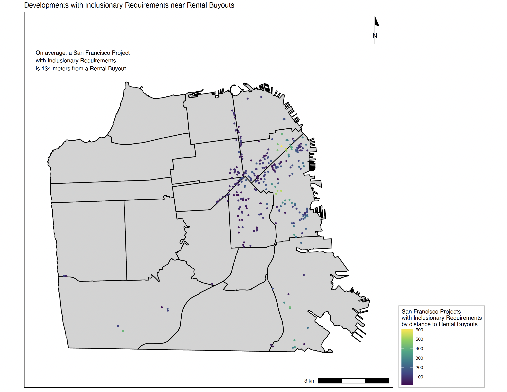
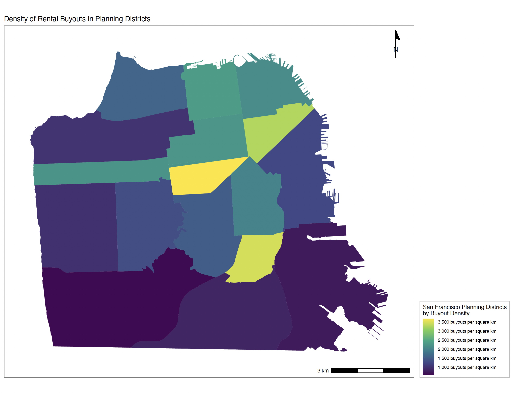
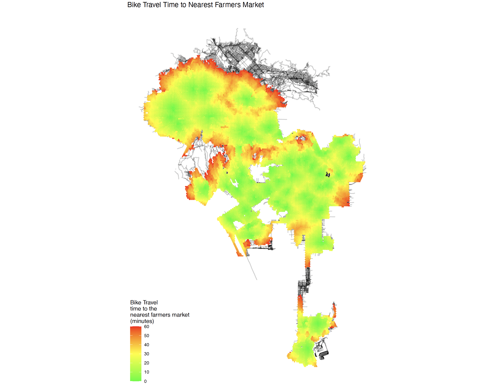
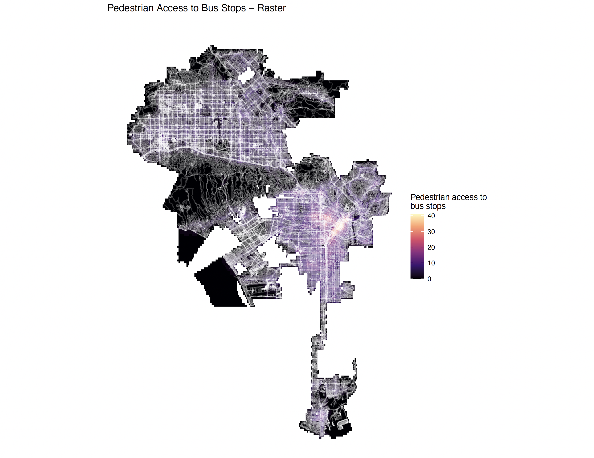
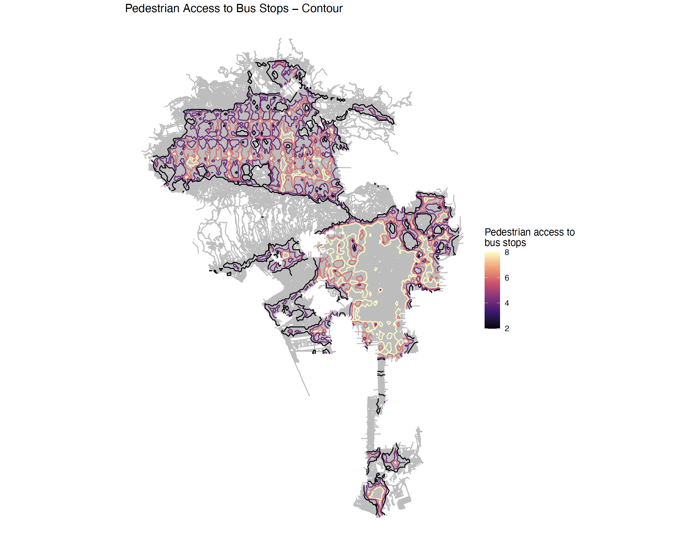
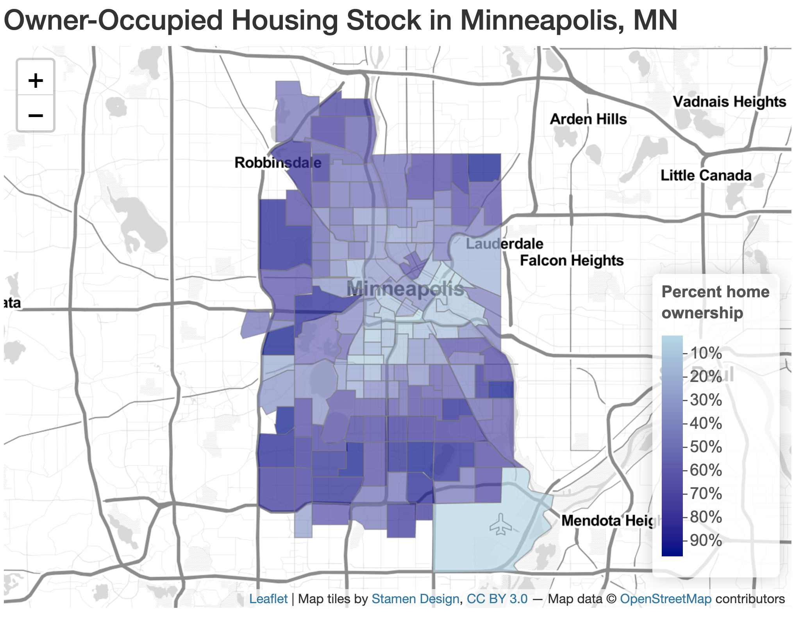

```{r setup, include=FALSE}
knitr::opts_chunk$set(echo = TRUE)
```

This portfolio  represents a body of work produced for the Spatial Analysis Course (VIS 2128) at the Harvard Graduate School of Design in the fall of 2021. This course provided an introduction to spatial analysis tools using R Studio and ArcGIS Pro. The maps in this portfolio are components of 6 assignments done over the course of 1.5 months. Specific skills demonstrated in this portfolio include:

* Displaying multiple vector layers on the same map
* Calculating and displaying relationships among point and polygon layers based on distance
* Displaying multiple vector layers on the same map
* Calculating and displaying relationships among point and polygon layers based on distance
* Aggregating point data to a layer of polygons
* Calculating and displaying accessibility, based on travel time
* Converting between raster layers and vector layers
* Displaying raster data on a map
* Georeferencing a raster image
* Displaying data on an interactive map

# Cambridge, MA

## Park Lights and Open Space
This map compares the presence of park lights with open space in Cambridge, MA. The comparison reveals some open spaces that do not have park lights, which illustrates a potential safety issue for park users. The transparency in the open space polygons reveals some locations where a water feature is present, so a park light should not be expected there. A further analysis could compare park usage at different times of day to find a correlation between park utilization and presence of street lights.

This map demonstrates the following skills: 

* Displaying multiple vector layers on the same map

[](https://halversonj.github.io/portfolio/fullsize/Cambridge_Lights_and_Open_Space.pdf){target="_blank"}

# East Boston, MA

## Current Hydrology vs. 1880 Land Mass
This map shows the current day hydrology of East Boston overlayed on a georeferenced map of the area from 1880. An interesting result is the comparison of current bodies of water compared to bodies of water in 1880 (displayed on the georeferenced map in a light green color). The large swath of 1880 water in the center of the map is where the current day airport is located. Another revelation is the small portions of 1880 water along the coast that were filled in to create docks and wharfs.

This map demonstrates the following skills:

* Georeferencing a raster image

[](https://halversonj.github.io/portfolio/fullsize/Hydrology_in_East_Boston.pdf){target="_blank"}

# San Francisco, CA

## Inclusionary Requirements and Rental Buyouts
This map shows development projects that have inclusionary development requirements based on proximity to rental buyouts in San Francisco. Rental buyouts occur when landlords terminate a lease and pay the tenant for the remaining months in order to vacate the building, presumably for future development. The map reveals a large number of developments with inclusionary requirements that are within 300 meters of a rental buyout, perhaps indicating areas experiencing gentrification and increased development.

This map demonstrates the following skills:

* Calculating and displaying relationships among point and polygon layers based on distance

[](https://halversonj.github.io/portfolio/fullsize/SF_Inclusionary_Near_Buyouts.pdf){target="_blank"}

## Rental Buyouts and Planning Districts
This map shows rental buyouts (previously mentioned) and planning district boundaries in San Francisco. The planning districts highlighted in a yellow or lighter shade of green are areas with greater densities of buyouts. These areas may be experiencing growth and gentrification as rental units are taken off the market and potentially redeveloped. Planners for the City of San Francisco may see a need to begin planning initiatives for areas with higher densities of buyouts in order to accommodate future growth appropriately.

This map demonstrates the following skills:

* Aggregating point data to a layer of polygons

[](https://halversonj.github.io/portfolio/fullsize/SF_Rental_Buyouts_in_Planning_Districts.pdf){target="_blank"}

# Los Angeles, CA

## Bike Travel Time to Farmers Markets
This map illustrates variation in travel time by bike to the nearest farmers market in throughout Los Angeles, CA. The map shows the official Los Angeles city limits, not Los Angeles county, so some farmers markets that are located in smaller adjacent cities are not represented. The resulting coloration reveals that most areas of LA have access to a farmers market within a 60-minute bike ride. The areas not colored in the red-to-green scale would take longer than 60 minutes to reach by bike. 

This map demonstrates the following skills:

* Calculating and displaying accessibility based on travel time

[](https://halversonj.github.io/portfolio/fullsize/LA _Bike_Time_to_Farmers_Markets.pdf){target="_blank"}

## Pedestrian Access to Bus Stops - Rasterized
This map shows pedestrian accessibility to bus stops in LA using a step decay function and a 10-minute walk time. The light yellow color is concentrated in downtown LA where there are more bus stops.

This map demonstrates the following skills:

* Displaying raster data on a map
* Calculating and displaying accessibility based on travel time

[](https://halversonj.github.io/portfolio/fullsize/LA_Ped_Access_Raster.pdf){target="_blank"}

## Pedestrian Access to Bus Stops - Contours
This map shows pedestrian accessibility to bus stops in LA using contours. The contours were created by converting a rasterized layer or accessibility into polygons. Areas within the contour lines all have the same accessibility score, calculated with a step decay function and based on a 10-minute walk time. The “best” accessibility (score of 8, colored in yellow) is centered in downtown LA, where there is a high density of bus stops.

This map demonstrates the following skills:

* Converting between raster layers and vector layers
* Calculating and displaying accessibility based on travel time

[](https://halversonj.github.io/portfolio/fullsize/LA_Ped_Access_Contour.pdf){target="_blank"}

# Minneapolis, MN

## Owner-Occupied vs. Renter-Occupied Housing
This interactive map uses 2019 ACS data to determine the percentage of housing stock that is owner-occupied in Minneapolis on a census tract level. The Uptown neighborhood and area surrounding the University of Minnesota has notably less owner-occupied housing, potentially due to the young adult and student populations living there.

This map demonstrates the following skills:

* Displaying data on an interactive map

[](https://halversonj.github.io/portfolio/fullsize/MSP_Ownership.html){target="_blank"}